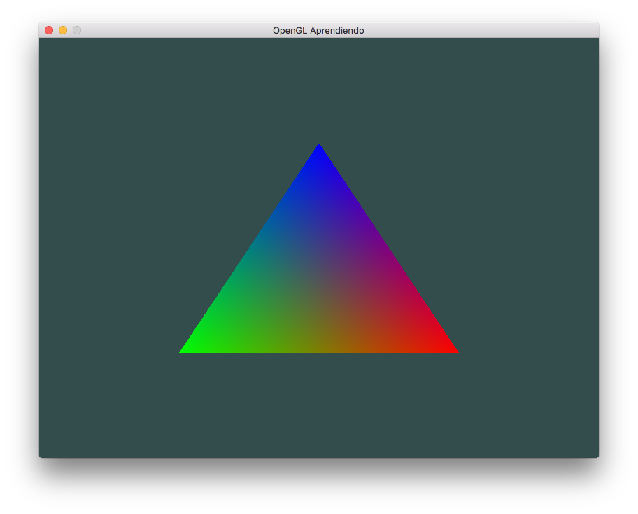

# OpenGLAprendiendo

Learning how to draw a triangle using OpenGL glfw and GLEW on macOS

## Note

This repo contains glfw v3.2.0 and GLEW v2.1.0 static libraries themselves and are linked in the Xcode project so that they don't need to be pulled in separately.  This might not be the best solution from a dependency standpoint, but it allows this project to build on it's own without any additional setup.

# References

* [Learn OpenGL](https://learnopengl.com)
* [Learn some more OpenGL](https://open.gl)
* [Setting up glfw and GLEW on macOS](https://www.youtube.com/watch?v=Tz0dq2krCW8)
* [Drawing a Triangle](https://www.youtube.com/watch?v=EIpxcNl2WJU)
